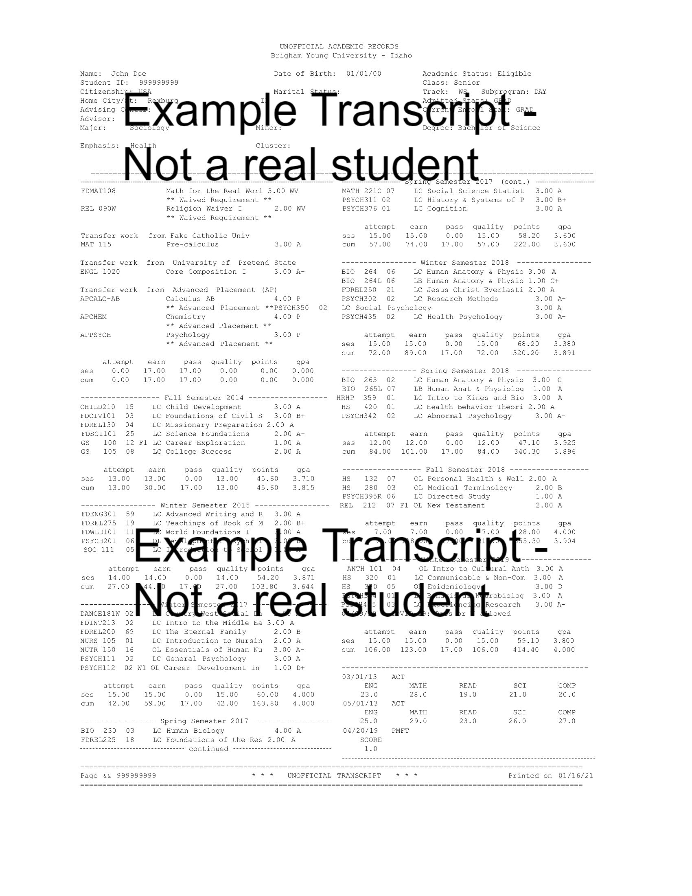

<!-- README.md is generated from README.Rmd. Please edit that file -->

# tidytranscript

<!-- badges: start -->
<!-- badges: end -->

The goal of tidytranscript is to make it easy to scrape data from
BYU-Idaho student transcripts.

## Installation

You can install the package available on [GitHub](https://github.com/)
with:

``` r
# install.packages("devtools")
devtools::install_github("averyrobbins1/tidytranscript")
```

## Example

This is a basic example which shows you how to read in a transcript and
get a student’s major:

``` r
library(tidytranscript)
dat <- read_transcript('data/my_transcript.pdf')
scrape_major(dat)
```

The main scraping functions are the following: 
* `scrape_major` - returns a student’s major 
* `scrape_birthday` - returns a student’s birthday 
* `scrape_earned_credits` - returns the total amount of credits earned by the student, including both transfer credits and credits acquired while at BYU - Idaho 
* `scrape_grades` - returns only those grades earned at BYU - Idaho (transfer grades were not important for our use case. If desired, feel free to figure that out and submit a pull request.)

To make life easier, all of the necessary functions have been compiled
into one master function `tidytranscript::tidytranscript`. Simply input
the path to the appropriate PDF and scrape all of the desired data in
one go. Below we are also using the function `get_example_file` to
*ahem* get the example file to use for this example. Example example
example.

``` r
library(tidytranscript)
my_file <- get_example_file()
dat <- tidytranscript(my_file)
head(dat)
#> # A tibble: 6 x 7
#>   course    credit grade semester birthday   major     earned_credits
#>   <chr>     <chr>  <chr> <chr>    <date>     <chr>              <dbl>
#> 1 CHILD 210 3.00   A     FA14     2000-01-01 Sociology            123
#> 2 FDCIV 101 3.00   B+    FA14     2000-01-01 Sociology            123
#> 3 FDREL 130 2.00   A     FA14     2000-01-01 Sociology            123
#> 4 FDSCI 101 2.00   A-    FA14     2000-01-01 Sociology            123
#> 5 GS 100    1.00   A     FA14     2000-01-01 Sociology            123
#> 6 GS 105    2.00   A     FA14     2000-01-01 Sociology            123
```

## Important Note

This package is only designed to scrape data from transcripts of the
following PDF format:


